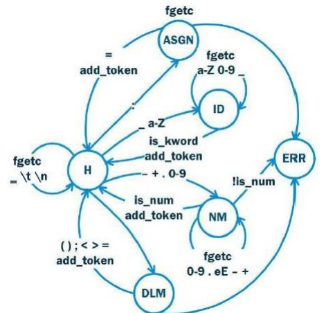

# Theory of formal languages
## Table of contents
- [Курсовая работа](#курсовая-работа "Курсовая работа")
- [Практическая работа №1-2](#преобразователь-выражения-в-обратную-польскую-запись "преобразователь выражения в обратную польскую запись")
- [Практическая работа №3](#лексический-анализатор-на-базе-конечного-автомата "Лексический анализатор на базе конечного автомата")
- [Практическая работа №4](#преобразователь-недетерминированного-конечного-автомата-нка-в-детерминированный-дка "Преобразователь недетерминированного конечного автомата (НКА) в детерминированный (ДКА)")
- [Практическая работа №5](#простой-анализатор-json-файла-с-использованием-flex "Простой анализатор JSON файла с использованием FLEX")

---

## Курсовая работа
> **Разработка распознавателя модельного языка программирования.**

> 

---

## Преобразователь выражения в обратную польскую запись
> [Задание](1-2PR.py) реализовано с возможностью подставновки переменных для вычисления выражения.

---

## Лексический анализатор на базе конечного автомата
> [Лексический анализатор](3PR.py) на базе конечного автомата входного языка, 
> описанного на Рисунке. Обрабатывает текст из [файла](files/test.txt) разбивая
> лексемы по классам.

---

## Преобразователь недетерминированного конечного автомата (НКА) в детерминированный (ДКА)
> После ввода множества состояний, множества входных состояний,
> множества конечных состояний, алфавита и функции переходов
> недетерминированного конечного автомата [преобразует](4PR.py) его в детерминированный
> конечный автомат и создаёт [графы](files/dependency_graphs) НКА и ДКА на языке Graphviz.

---

## Простой анализатор JSON файла с использованием FLEX
> [Обработка](5PR) несуществующей лексемы: вывести лексему без соотношения
> к определенному классу токенов. 
>
> Лексемы:
> * символы
>  * BEGIN_OBJECT ( { ); 
>  * END_OBJECT ( } ); 
>  * BEGIN_ARRAY ( [ ); 
>  * END_ARRAY ( ] ); 
>  * COMMA ( , ); 
>  * COLON ( : ); 
> * литералы 
>  * LITERAL ( true, false, null); 
> * строки 
>  * STRING ( “string” ); 
> * числа 
>  * NUMBER ( 1, -1, +1, 1e1000 ).

---
